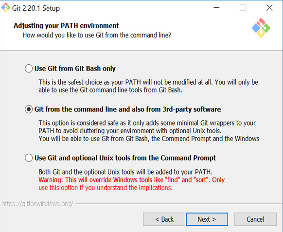
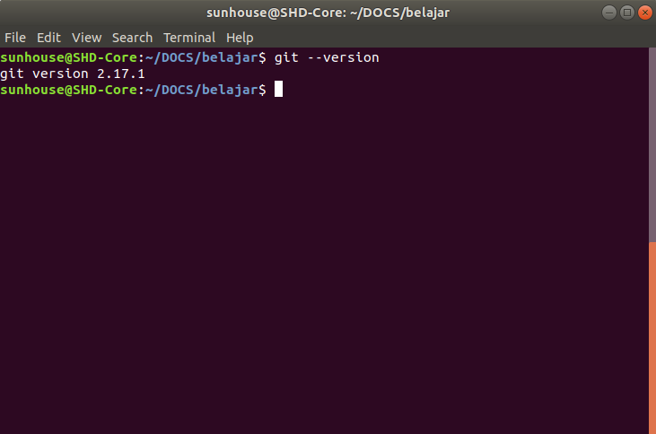
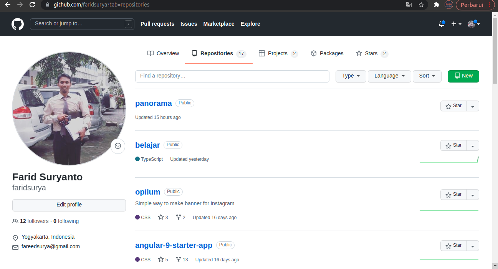
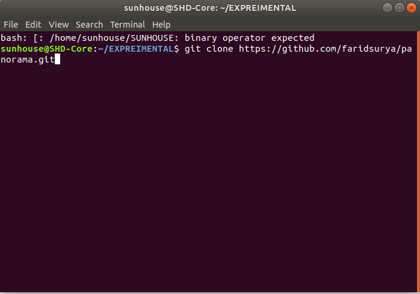
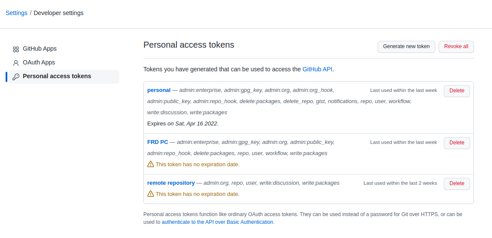

# Pengelolaan Repositori Menggunakan Github

*Ditulis oleh [Farid Suryanto](https://github.com/faridsurya)*

## Git pada Sistem Operasi Windows

Secara default, Git diinstal pada komputer Linux dan macOS sebagai *command line*. Microsoft Windows tidak menyertakan perintah Git. Oleh sebab itu, untuk Anda pengguna windows maka Anda harus melakukan instalasi perangkat lunak tambahan untuk dapat menggunakan github. Berikut adalah langkah-langkah tentang cara menginstal dan menggunakan Git dan GitHub di Microsoft Windows.

1. [Buka situs Git](https://git-scm.com/).

2. Klik tautan Unduh untuk mengunduh Git. Pengunduhan akan dimulai secara otomatis.

3. Setelah diunduh, mulailah penginstalan dengan mengeksekusi file hasil download.

4. Di jendela Select Components, biarkan semua opsi default dicentang dan centang komponen tambahan lainnya yang ingin Anda instal.

5. Selanjutnya, di bagian Memilih editor default, yang digunakan oleh Git. Sebaiknya Anda menggunakan editor teks yang nyaman Anda gunakan. Jika Vs Code terinstal, kami sarankan untuk menggunakannya sebagai editor Anda. 

6. Selanjutnya, pada tahap **Adjusting your PATH environment**, kami sarankan untuk menyimpan Use **Use Git from the command line and also from 3rd-party software** seperti yang ditunjukkan di bawah ini. Opsi ini memungkinkan Anda untuk menggunakan Git dari Git Bash atau Windows Command Prompt.

   

7. Selanjutnya, kami sarankan membiarkan **Use OpenSSH** dipilih.

8. Pada tahap **Choosing HTTPS transport backend**, biarkan **OpenSSL library** yang dipilih.

9. Dalam **Configuring the line ending conversions**, pilih **Checkout Windows-style, commit Unix-style line endings**.

10. Di jendela **Configuring the terminal emulator to use with Git Bash**, pilih **Use MinTTY (the default terminal of MSYS2)**.

11. Pada jendela **Configuring extra options**, biarkan opsi default dicentang.

12. Klik tombol Install.

13. Setelah selesai, Anda dapat mememilih opsi untuk *Launch Git Bash* jika Anda ingin membuka baris perintah Bash atau, jika Anda memilih baris perintah Windows, jalankan Git *command line* Windows.

Berikut ini adalah tampilan GIT pada windows:


Tampilan GIT mirip dengan tampilan Command Line Interface (CLI) pada windows. Nantinya Anda akan menuliskan perintah-perintah git menggunakan CLI seperti pada gambar di atas. Pada gambar di atas dapat diidentifikasi kondisi sebagai berikut:

- Git berada pada folder `/dropbox/git/example`. Itu berarti bahwa repositori lokal untuk repositori github dengan ID example berada pada folder `/dropbox/git`.
- Target folder untuk eksekusi perintah-perintah git dapat dilakukan dengan mengarahkan folder ke halaman tersebut. Anda dapat menggunakan perintah `cd` atau dapat juga dengan melakukan **klik kanan** pada folder yang ditargetkan kemudian pilih **Gitbash Here**.

## Git pada Linux

Git secara default sudah terpasang pada sistem operasi Linux. Cara menggunakannya adalah dengan menggunakan terminal. Terminal adalah termasuk dalam CLI (*command line interface*). Tampilan terminal pada Linux adalah sebagai berikut:



CLI seperti pada gambar di atas memiliki fungsi yang sama dengan gitbash pada windows.

## Konfigurasi Global

Jika Anda adalah pertama kali menggunakan git maka Anda perlu melakukan konfigurasi global git. Buka command line dan tulis perintah berikut:

```bash
git config --global user.name "<your name>"
```

```bash
git config --global user.email "<your e-mail>"
```

## Membuat Repositori pada Github

Repositori adalah tempat penyimpanan file terdistribusi. Disebut dengan terdistribusi karena file-file tersebut tersimpan dalam tempat penyimpanan di cloud dan dapat di duplikasi pada perangkat lokal. Cara tersebut saat ini digunakan oleh para pengembang sebagai alat kolaborasi pengembangan karena file-file pengembangan sistem akan selalu 'sama' meskipun dibangun oleh beberapa developer di perangkat yang berbeda-beda.

Untuk menggunakan fasilitas repositori pada Github, pertama, Anda harus membuat akun terlebih dahulu pada [github.com](https://github.com). Anda dapat membuat akun menggunakan layanan Gmail atau membuat akun menggunakan email dan password. Pastikan Anda dapat membuat akun tersebut untuk dapat mengikuti proses berikutnya.

Jika Anda sudah berhasil membuat akun, maka Anda dapat masuk pada tampilan repositories seperti pada gambar berikut:



Pada tab menu Repositories terdapat tombol **New**. Itu adalah tombol untuk membuat repositori baru. Tombol tersebut akan mengarah pada halaman pembuatan repositori baru seperti pada gambar dibawah:


Anda dapat menentukan nama dan deskripsi untuk repositori Anda. Untuk keperluan belajar pada materi teknologi web, Pilih setelan **Public** agar latihan-latihan yang Anda kerjakan dapat dilihat oleh orang lain.

 ## Membuat Duplikasi Repositori pada Perangkat Lokal

Membuat duplikasi repositori github pada perangkat lokal dikenal dengan istilah **cloning**. Jika repositori disetel Public maka siapapun akan dapat menduplikasi repositori Anda di github tapi hanya Anda yang dapat mengunggah file kecuali jika Anda memberikan hak kepada orang lain.

Ada dua metode yang disediakan github untuk menduplikasi repositori ke perangkat lokal:

- Metode HTTPS. Metode ini cukup sederhana karena tidak perlu melakukan konfigurasi pada pengaturan profile github.
- Metode SSH. Metode ini memerlukan kode SSH yang digenerate melalui komputer lokal kemudian melampirkannya pada pengaturan profile github. Metode ini akan dibahas pada versi dokumen berikutnya.


Gambar di atas menunjukkan URL yang berbeda untuk metode HTTPS dan SSH.

Perintah berikut adalah digunakan untuk membuat repositori lokal dari repositori github dengan ID `panorama` menggunakan metode HTTPS:

```bash
git clone https://github.com/faridsurya/panorama.git
```

Jalankan perintah di atas pada folder yang Anda pilih sebagai penyimpanan lokal di perangkat Anda. Misalnya seperti yang terlihat pada gambar berikut ini:



Target folder untuk penyimpanan lokal pada kasus di atas adalah folder `experimental`. Anda yang menggunakan windows dapat menggunakan Gitbash (baca materi sebelumnya). Hasil eksekusi dari perintah `clone` adalah pembuatan folder baru dengan nama yang sesuai dengan ID repositori pada github. Pada kasus di atas, nama folder yang tercipta adalah `panorama`.

## Mengunggah File ke Repositori Github

Ada beberapa cara untuk mengunggah file ke repositori github. 

### Cara 1 - Github upload 


Github menyediakan pengunggahan file melalui halaman upload file. Anda dapat memanfaatkan itu untuk mengunggah file. Tapi Anda tidak dapat mengunggah banyak file menggunakan fitur ini. Untuk mengunggah file-file lokal ke repositori github, disarankan menggunakan git.

### Cara 2 - Git

Ada dua langkah utama untuk mengunggah file-file pada repositori lokal ke *remote* yaitu membuat access token pada github dan mengatur access token yang dibuat pada repositori lokal. Access token adalah kode khusus yang memberikan hak akses pada perangkat yang digunakan untuk melakukan beberapa aksi pada repositori remote.

#### Membuat Personal Access Token

Anda dapat membuat Personal Access Token (PAT) dengan mengakses halaman `Profile >> Settings >> Developer Settings >> Personal Access Tokens`. 



Menggunakan tombol **Generate new token** Anda dapat membuat Personal Access Token. Pembuatan token baru akan meminta konfirmasi password. Anda harus menulis password Github Anda! Berikutnya Anda akan menentukan tanggal kadaluarsa dari token tersebut.

Personal access token adalah satu baris karakter acak. Copy kode tersebut. Jika perlu simpan terlebih dahulu karena **kode tidak lagi dapat melihatnya ketika halaman generate token sudah ditutup**. 

#### Mengatur Access Token pada Repositori Lokal

Langkah berikutnya adalah mengatur repositori lokal menggunakan access token yang sudah digenerate. Buka git dengan target folder repositori lokal. Untuk contoh, kita akan menggunakan repositori `panorama`. Buka git pada folder panorama kemudian isikan perintah berikut:

```bash
git remote set-url origin https://[access_token]@github.com/faridsurya/panorama.git
```

Contoh implementasinya adalah sebagai berikut:


Gambar di atas menunjukkan bahwa pengaturan access token pada repositori lokal untuk ID repositori `panorama` sudah berhasil. Berikutnya Anda dapat melakukan penambahan, update, maupun unduh file-file pada repositori remote.

#### Mengunggah file-file lokal ke remote

Mengunggah file ke repositori remote biasa dikenal dengan istilah *push*. Untuk melakukannya, ikuti langkah berikut:

1. Pastikan pada folder repositori lokal sudah berisi file-file yang akan diunggah. Ini juga berlaku untuk pembaruan file. Anda cukup melakukan perubahan file pada folder tersebut maka git akan memilih secara otomatis file-file yang mengalami perubahan dan harus di unggah pada repositori remote. Pada kasus ini kita akan menambahkan file sederhana dengan nama `index.html`. 

   ```html
   <!DOCTYPE html>
   <html>
   <head>
   <title>Page Title</title>
   </head>
   <body>
   
   <h1>My First Heading</h1>
   <p>My first paragraph.</p>
   
   </body>
   </html>
   ```

2. Arahkan git pada folder `panorama` lalu jalankan perintah berikut ini secara berurutan:

   ```bash
   git add .
   ```

   ```bash
   git commit -m 'menambahkan index.html'
   ```

   ```bash
   git push origin main
   ```

   - Perintah `git add .` (terdapat simbol titik dibelakang) digunakan untuk memasukkan semua file pada daftar yang akan diunggah.
   - Perintah `git commit -m "pesan"` digunakan untuk mengemas file-file yang dipilih pada proeses sebelumnya serta menambahkan pesan perubahan.
   - Perintah `git push origin main` digunakan untuk mengunggah fil-file yang dikemas ke repositori remote pada branch `master`. Berkaitan dengan branch nanti akan dibahas secara khusus mengenai pengelolaan branch pada github.

   Berikut ini adalah contoh tampilan ketika berhasil melakukan pemindahan file dari lokal ke remote:

   

3. Jika berhasil maka lihat pada repositori github (remote). File baru dengan nama `index.html` sudah berhasil ditambahkan seperti yang terlihat pada gambar berikut:

   

   

## Sinkronisasi File *Remote* dan Lokal

1. Update file pada repositori lokal agar sama dengan remote.

   Untuk melakukan update file lokal agar sesuai dengan file pada repositori remote maka jalankan perintah berikut:

   ```
   git pull
   ```

   Perintah diatas akan menyamakan file-file lokal dengan file remote.

2. Menghapus file atau folder pada repositori remote.

   Untuk menghapus file-file pada repositori remote, anda dapat melakukannya dengan menghapus file-file pada repositori lokal kemudian melakukan `git push` seperti yang sudah dijelaskan sebelum ini.


## Membuat Github Page

Github menyediakan fitur github page. Itu adalah cara untuk mempublikasikan aplikasi web sehingga dapat berjalan dan dapat diakses melalui internet. Ikuti langkah berikut untuk membuat github page:

1. Buka halaman **Settings** pada halaman repositori Anda kemudian masuk ke menu **Pages**.

2. Pilih dropdown menu untuk mengarahkan folder yang akan ditampilkan pada pada halaman github. Pilhannya selalu master atau docs. Pilih master agar folder yang di publikasikan adalah folder master. Tampilan pengaturan adalah sebagai berikut:

   

   Keterangan *Your site is published at https://faridsurya.github.io/panorama/* menandakan bahwa halaman sudah siap dan dapat diakses melalui internet. Proses ini membutuhkan waktu sampai github melakukan eksekusi publikasi halaman.

Anda dapat memanfaatkan fitur github page ini untuk mempublikasikan karya-karya yang menjadi portfolio Anda. Saat ini banyak peluang pekerjaan yang memanfaatkan github sumber terbuka sebagai cara untuk menilai kehalian seseorang.

## Referensi

https://www.computerhope.com/issues/ch001927.htm
