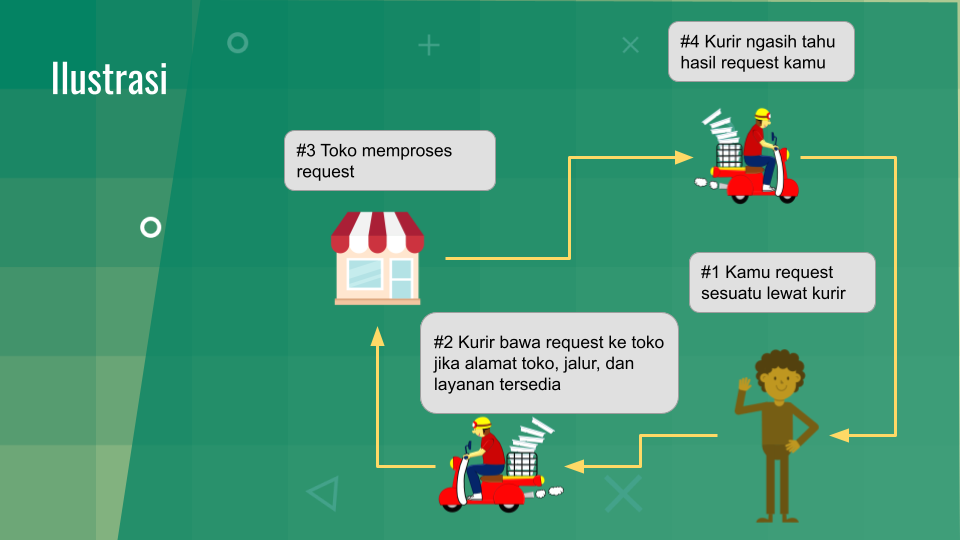

# Pengantar Teknologi Website

## Apa yang dipelajari?

Setelah mengikuti kursus ini, diharapkan Anda dapat menguasai hal-hal berikut:

- Mendemonstrasikan keterampilan dalam teknologi pengembangan aplikasi sisi klien (Front-end) seperti HTML, CSS, Javascript, dan librari-librari Javascript.
- Mendemonstrasikan keterampilan dalam teknologi pengembangan aplikasi web sisi server menggunakan bahasa pemrograman sisi server seperti Node/Express, Python/Django, dll.
- Membuat aplikasi web yang berfungsi untuk proses bisnis tertentu menggunakan front-end, back-end, SQL, dan alat pengembangan web terkini.
- Menerapkan aspek keamanan untuk aplikasi web.
- Melakukan debug pada kesalahan sintak dan logika.
- Melakukan deploy aplikasi web ke hosting server.

## Terminologi Penting

| Terminologi                       | Deskripsi                                                    |
| --------------------------------- | ------------------------------------------------------------ |
| Web page                          | Sebuah dokumen yang dapat ditampilkan dalam sebuah web browser seperti Firefox, Google Chrome, Opera, Microsoft Internet Explorer atau Edge, atau Safari Apple. Ini juga sering disebut dengan istilah "halaman" atau "laman". |
| Web Site                          | Kumpulan halaman web yang dikelompokkan secara bersama dan biasanya dihubungkan dengan sebuah mekanisme navigasi. Istilah web site juga sering disebut "situs web" atau hanya "situs". |
| HTML (Hypertext Markup Language)  | Kodifikasi yang memiliki struktur khusus dan digunakan untuk menampilkan dokumen pada halaman web. |
| Web Server                        | Komputer dengan kemampuan khusus yang menyediakan dokumen-dokumen dan terhubung jaringan internet sehingga dokumen-dokumen tersebut dapat diakses melalui komputer lain yang terhubung dalam jaringan internet. |
| Web Browser                       | Perangkat lunak komputer yang digunakan untuk mengakses halaman web. |
| URL (*Uniform Resource Locator* ) | Rangkaian karakter yang menunjukkan alamat sebuah halaman web pada internet. |
| Protocol                          |                                                              |
| Internet Protocol (IP) Address    |                                                              |
| HTTP                              |                                                              |
| HTTPS                             |                                                              |
| FTP                               |                                                              |
|                                   |                                                              |
| DNS                               |                                                              |
| Gateway                           |                                                              |
| API                               |                                                              |

## Bagaimana Aplikasi Web Berjalan?

Gambar di atas menunjukkan skema teknologi web. Terdapat tiga komponen utama yaitu klien, jaringan, dan web server. Klien melakukan permintaan data melalui sebuah domain atau alamat IP yang mengarahkan pada sebuah halaman pada server. Jika alamat tersebut terhubung internet dan data tersedia maka server mengirimkan respon berupa dokumen kepada klien. Dokumen tersebut dapat berupa dokumen HTML, image, XML, JSON, dan beberapa dokumen lain yang dapat ditransmisikan melalui jaringan internet.

 

Gambar di atas menunjukkan ilustrasi tentang bagaimana teknologi web berjalan. Orang yang melakukan pesanan diibaratkan sebagai web browser, kurir diibaratkan sebagai jaringan internet, dan toko sebagai web server. Data yang dikirimkan dari klien ke server (request) atau dari server ke klien (response), pada ilustrasi di atas, digambarkan dengan barang-barang yang dibawa oleh kurir.

