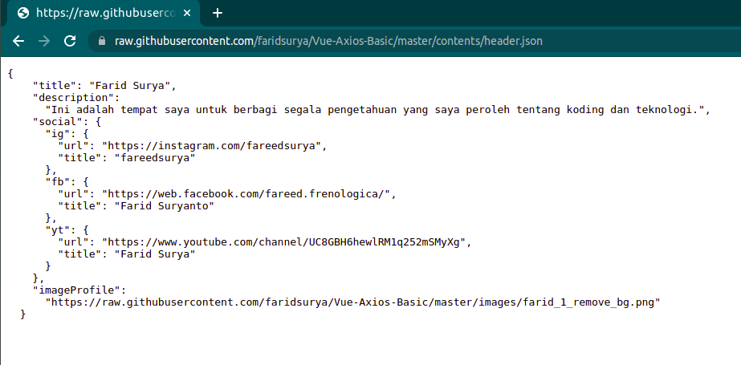
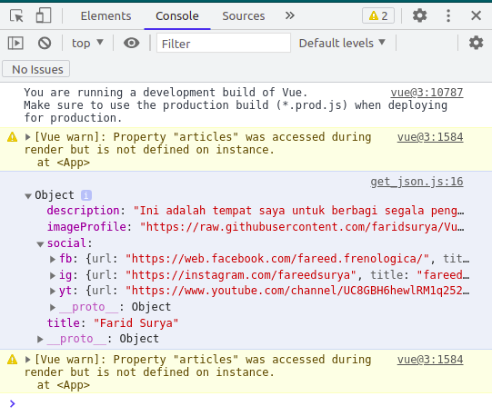

# Mengambil Data JSON Menggunakan Axios

Bagian ini membahas mengenai cara komunikasi data antara sistem dengan penyedia data di luar sistem menggunakan metode HTTP. Format data yang dibahas pada bagian adalah JSON yang dapat disediakan melalui file berekstensi `.json` atau sebuah tautan yang menyediakan luaran berupa `application/json`. 

Keterampilan yang dibahas pada bagian ini merupakan keterampilan dasar untuk melakukan integrasi aplikasi front-end dengan server yang menyediakan data. Sebagai latihan, data JSON yang digunakan merupakan file dalam ekstensi `.json` yang tersimpan pada repositori github. Berikutnya, file tersebut akan diambil oleh sistem kemudian ditampilkan pada halaman web.

## Apa yang dipelajari?

- Instalasi axios pada dokumen HTML.
- Mengambil data JSON pada repositori github menggunakan metode GET.
- Struktur pada Vue.js untuk menangani fungsi pengambilan data.
- Penanganan error pada *declarative rendering*.

## Instalasi Axios

Axios merupakan sebuah library Javascript untuk menangani masalah koneksi HTTP. Axios mendukung semua metode pada HTTP seperti GET, POST, PUT, DELETE untuk melakukan komunikasi dengan server. Pada pengembangan sistem, metode tersebut sering digunakan untuk menangani CRUD (Create, Read, Update, dan Delete) data pada server.

Instlasi axios dapat dilakukan dengan melampirkan tautan dibawah tautan untuk vue.js seperti pada kode HTML berikut:

```html
<script src="https://unpkg.com/vue@3"></script>
<script src="https://cdn.jsdelivr.net/npm/axios/dist/axios.min.js"></script>
```

## Mengambil data Menggunakan Metode GET

Sebelum membaca bagian ini, pastikan Anda sudah mempelajari struktur program pada vue.js pada bagian sebelumnya. Mekanisme pengambilan data akan kita terapkan pada sebuah fungsi pada bagian methods. Trigger (pemantik) untuk mengeksekusi fungsi pada method dapat menggunakan sebuah aksi yang dilakukan oleh pengguna atau dapat juga menggunakan *initial function* yang dieksekusi saat halaman terbuka. Pada kasus ini kita akan mengesekusi fungsi pengambilan data menggunakan status *beforeMount* pada vue sehingga saat halaman terbuka maka fungsi pengambilan data akan dijalankan.

**get_json.js**

```javascript
Vue.createApp({
  data() {
    return {
      message: "Hello Vue!",
      header: {},
    };
  },
  methods: {
    getHeaderData()
    {
      axios
        .get(
          "https://raw.githubusercontent.com/faridsurya/Vue-Axios-Basic/master/contents/header.json"
        )
        .then((res) => {
          console.log(res.data); //melihat respon data pada console browser
          this.header = res.data; //memperbarui variabel header pada bagian data()
        })
        .catch((error) => {
          console.log(error); //melihat error jika pengambilan data adalah gagal
        });
    }
  },
  beforeMount() {
    this.getHeaderData() //eksekusi fungsi getHeaderData() pada bagian methods saat halaman terbuka
  },
}).mount("#app");
```

 Penggunaan axios untuk pengambilan data menggunakan metode GET ada pada fungsi `getHeaderData()` yang itu dijalankan saat halaman terbuka. Perhatikan pemanggilan fungsi `this.getHeaderData()` pada bagian `beforeMount()`. Metode komunikasi HTTP yang digunakan oleh axios adalah GET. Secara umum struktur axios untuk komunikasi data dengan metode GET adalah sebagai berikut:

```javascript
axios.get(url).then(successFunction).catch(errorHandling);
```

`url` adalah alamat untuk file JSON. Pada contoh kasus ini, kita menggunakan sebuah file JSON yang disimpan pada repositori github. Contoh data jika diakses pada halaman web adalah sebagai berikut:



Gambar di atas menunjukkan format data JSON dengan struktur yang sama dengan contoh pada bagian sebelumnya. Pada bagian sebelumnya, data tersebut dituliskan pada bagian `data()` menggunakan variabel `header`. Pada latihan ini, kita simpan data tersebut pada repositori github dengan nama `header.json` kemudian dipanggil pada sisi klien menggunakan metode GET oleh axios.

`successFunction` pada kode `get_json.js` adalah untuk menangani kondisi jika pengambilan data adalah berhasil. Pada kondisi tersebut maka variabel `header` pada bagian `data()` diperbarui dengan data yang baru. Oleh sebab itu variabel `header` yang awalnya hanya merupakan sebuah objek kosong, ketika data berhasil diambil maka variabel `header` memiliki nilai seperti pada file `header.json` yang diambil dari sebuah url.



Gambar di atas menunjukkan hasil yang ditampilkan pada bagian console browser oleh program yang ditulis pada baris ke 16 file `get_json.js` yaitu perintah `console.log(res.data);`. Hasil tersebut menunjukkan bahwa perintah pengambilan data adalah sukses. Dengan demikian variabel `header` pada bagian `data()` akan di update. Berikutnya kita tinggal menangani masalah *declarative rendering* untuk menampilkan data pada sisi template.

## Penanganan Error pada *Declarative Rendering*

Ada permasalahan yang muncul pada proses rendering data ke bagian template jika pada bagian `data()` hanya didefinisikan variabel `header` sebagai objek kosong (`{}`). Permasalahan tersebut dapat dilihat pada bagian error browser:


Gambar di atas menunjukkan error bahwa property `ig` tidak dapat diambil dari variabel yang tidak terdefinisi. Itu disebabkan karena *declarative rendering* berikut:

```html
<a v-bind:href="header.social.ig.url"><i class="bi-instagram"></i> {{header.social.ig.title}}</a>
```

Kode di atas pertama kali akan membaca variabel `header` yang berupa objek kosong (`{}`). Oleh sebab itu property `social` pada `header.social` adalah sebuah property yang **tidak terdefinisi**. Javascript akan menampilkan error jika kita berusaha mengambil sebuah property dari objek yang tidak terdefinisi. Oleh sebab itu kita perlu mendefinisikan kondisi untuk menangani error tersebut.

```html
<a v-bind:href="header.social == undefined ? '':header.social.ig.url"><i class="bi-instagram"></i> {{header.social == undefined ? '':header.social.ig.title}}</a>
```

Kode diatas adalah menerapkan kondisional pada javascript. Struktur kondisional yang digunakan dapat digambarkan menggunakan logika sebagai berikut:

```javascript
let nilai = 83;
let status = nilai > 80 ? 'Lulus':'Tidak Lulus';
```

Program diatas akan membuat variabel `status` merupakan variabel string dengan nilai `Lulus`. `nilai > 80` adalah kondisi yang ditetapkan. `Lulus` adalah nilai jika kondisi terpenuhi dan `Tidak Lulus` adalah nilai jika kondisi tidak terpenuhi. Teknik tersebut digunakan pada `header.social == undefined ? '':header.social.ig.title` agar `header.social.ig` dieksekusi hanya jika `header.social` terdefinisi.

## Latihan 2

1. Buatlah file `articles.json` pada repositori github Anda yang berisi daftar artikel dengan struktur minimal adalah sebagai berikut:

   ```json
   [
   	{
   		"title":"Judul Artikel",
           "description": "Descripsi singkat artikel",
           "thumbnail": "url gambar thumbnail",
           "author": "Nama Penulis",
           "published_at": "Tanggal terbit"
   	}
   ]
   ```

2. Buatlah fungsi pada bagian method dengan nama `getArticles()` kemudian isi fungsi tersebut dengan perintah axios untuk mengambil data `articles.json` yang tersimpan pada repositori github Anda.
3. Tampilkan daftar artikel pada template.
